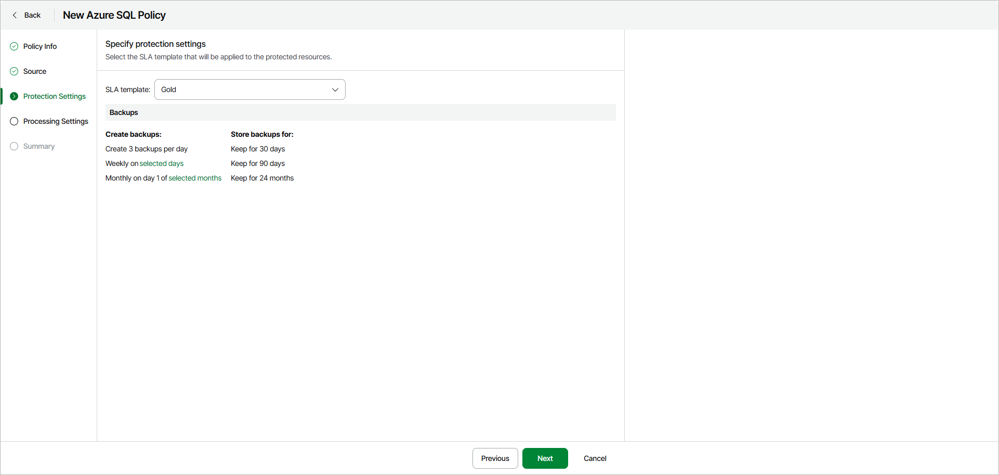

# Step 4. Specify Policy Protection Settings

In this article

At the Protection Settings step of the wizard, select an SLA template that will be applied to the protected resources.

|  |
| --- |
| Note |
| Veeam Data Cloud for Microsoft Azure creates backups automatically according to the schedule of the selected SLA template. You cannot run ad hoc backups manually. |

You can select one of the following SLA templates:

* Gold — select this option if you want to create backups with the following settings:

* Daily backups are created every 8 hours and retained for 30 days.
* Weekly backups are created once per day and retained for 90 days.
* Monthly backups are created on the first day of each month and retained for 24 months.

* Silver — select this option if you want to create backups with the following settings:

* Weekly backups are created once per day and retained for 30 days.
* Monthly backups are created on the first day of each month and retained for 12 months.

* Bronze — select this option if you want to create backups with the following settings:

* Weekly backups are created every Monday and retained for 30 days.
* Monthly backups are created on the first day of each month and retained for 12 months.

|  |
| --- |
| Note |
| To store backups, Veeam Data Cloud for Microsoft Azure automatically creates a repository in every Azure region whose resources are protected by the backup policy. |

Page updated 1/12/2026
