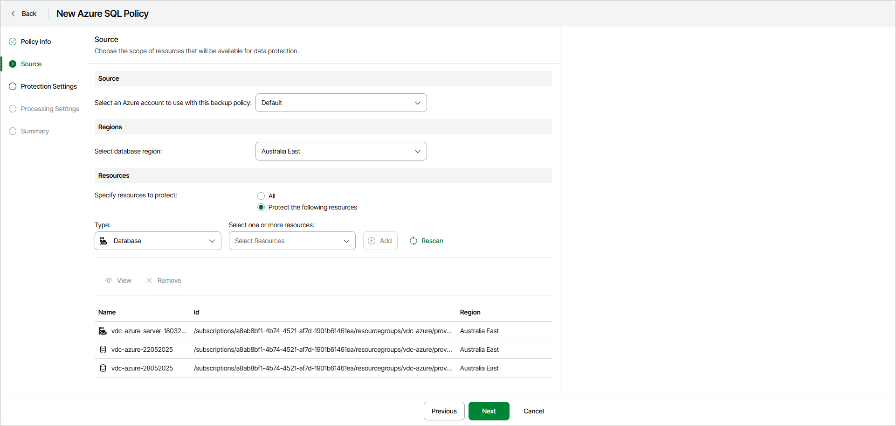

# Step 3. Specify Policy Source

At the Source step of the wizard, specify an Azure account, regions and resources to back up:

1. In the Source section, specify an Azure account that has access to Azure resources that you want to protect with the backup policy.
2. In the Regions section, specify a region whose resources you want to protect with the backup policy.

|  |
| --- |
| Note |
| Each Azure SQL backup policy protects resources in only one region. If you want to protect resources in multiple regions, you must create a separate backup policy for each region. |

1. In the Resources section, specify what resources you want to protect with the backup policy:

* Select All if you want to protect all resources available in the selected regions.
* Select Protect the following resources if you want to protect specific resources in the selected regions.

1. [For the Protect the following resources option] Do the following:

1. From the Type drop-down list, select a type of the resource that you want to protect. You can select the following options:

* Database — select this option if you want to protect specific databases.
* SQL Server — select this option if you want to protect the whole SQL servers.

1. From the Select one or more resources drop-down list, select resources that you want to protect.

After you define the backup scope, you can select a resource and perform the following actions:

* Click View to display detailed resource information.
* Click Remove to remove the resource from the backup policy.

