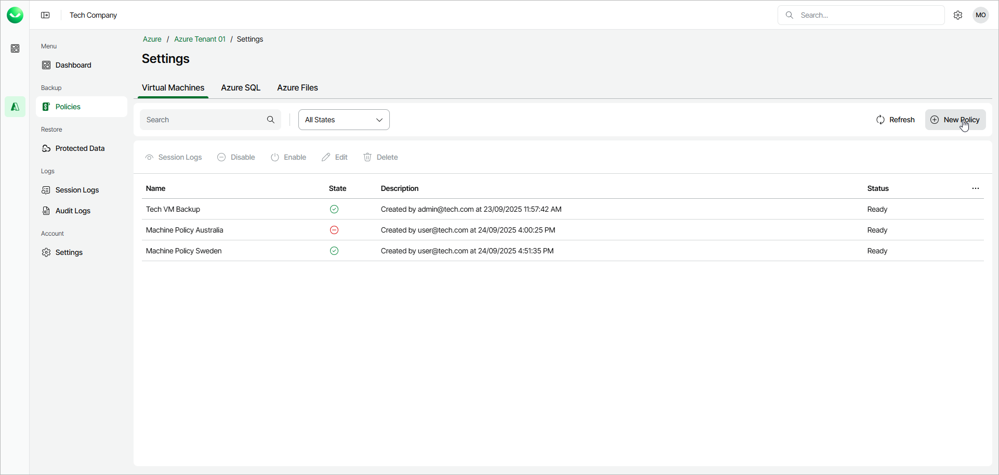

# Step 1. Launch New Azure Virtual Machine Policy Wizard

To launch the New Azure Virtual Machines Policy wizard, do the following:

1. In the Backup section of the main menu, select Policies.
2. Select the Virtual Machines tab and click New Policy.

