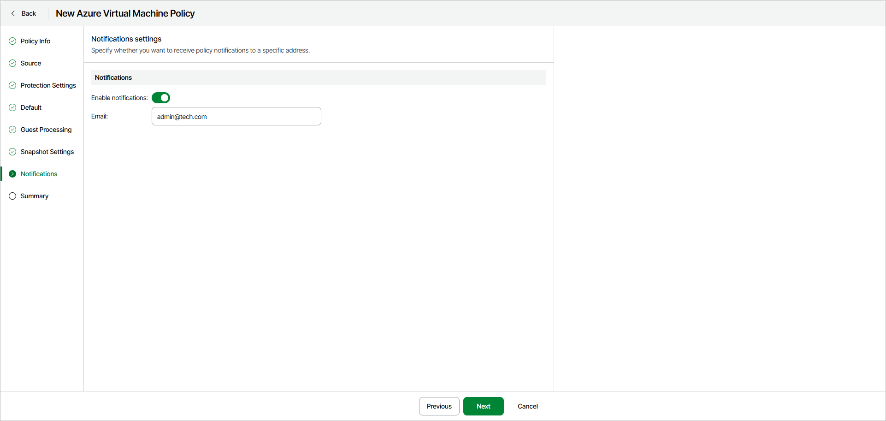

# Step 8. Specify Notifications Settings

In this article

The Notifications step of the wizard is available if you have enabled the advanced settings configuration at the [Summary](azure_backup_create_vm_review.md) step of the wizard.

If you want to get notifications about the policy completion results, turn on the Enable notifications toggle and specify your email address in the Email field. The notifications will include the policy name, the date and time the policy was executed, and the completion status — Success, Warning or Error.

Page updated 10/2/2025
