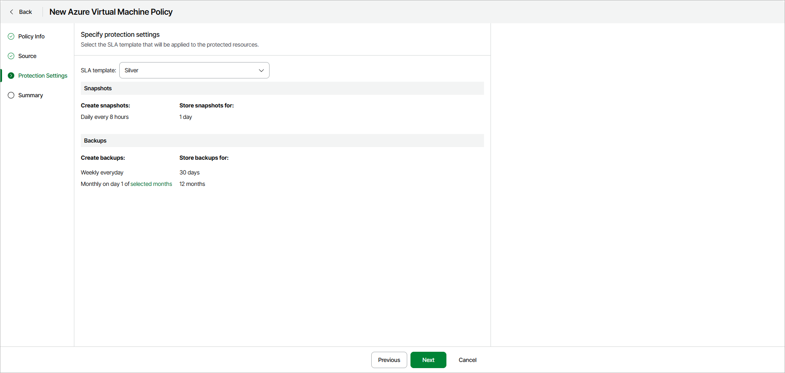
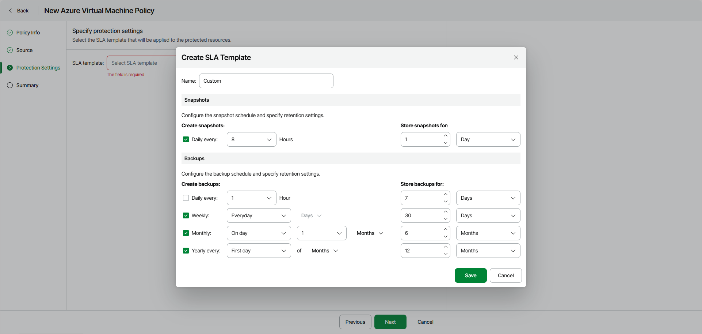

# Step 4. Specify Policy Protection Settings

At the Protection Settings step of the wizard, select an SLA template that will be applied to the protected resources. You can select a predefined or custom SLA template.

|  |
| --- |
| Note |
| Veeam Data Cloud for Microsoft Azure creates backups automatically according to the schedule of the selected SLA template. You cannot run ad hoc backups manually. |

Using Existing SLA Template

To use an existing SLA template, select one of the options from the SLA template drop-down list.

When you create a backup policy for the first time, only the predefined templates will be available. If you have already created [a custom SLA template](#custom), it will also appear in the list.

The predefined options are the following:

* Gold — select this option if you want to create VM snapshots and backups with the following settings:

* Snapshots are created every hour and retained for 1 day.
* Daily backups are created every 8 hours and retained for 30 days.
* Weekly backups are created once per day and retained for 90 days.
* Monthly backups are created on the first day of each month and retained for 24 months.

* Silver — select this option if you want to create VM snapshots and backups with the following settings:

* Snapshots are created every 8 hours and retained for 1 day.
* Weekly backups are created once per day and retained for 30 days.
* Monthly backups are created on the first day of each month and retained for 12 months.

* Bronze — select this option if you want to create VM snapshots and backups with the following settings:

* Snapshots are created every 24 hours and retained for 7 days.
* Weekly backups are created every Monday and retained for 30 days.
* Monthly backups are created on the first day of each month and retained for 12 months.

Creating New SLA Template

To create a custom SLA template, click Create and configure the desired snapshot and backup schedule in the Create SLA Template window.

Keep in mind that if you configure a schedule but do not select the corresponding check box, Veeam Data Cloud will ignore the specified settings and will not create snapshots or backups.

After you save the SLA template, you will be able to use it in other VM backup jobs.

|  |
| --- |
| Note |
| The number of custom templates for a tenant is limited to 5. |

