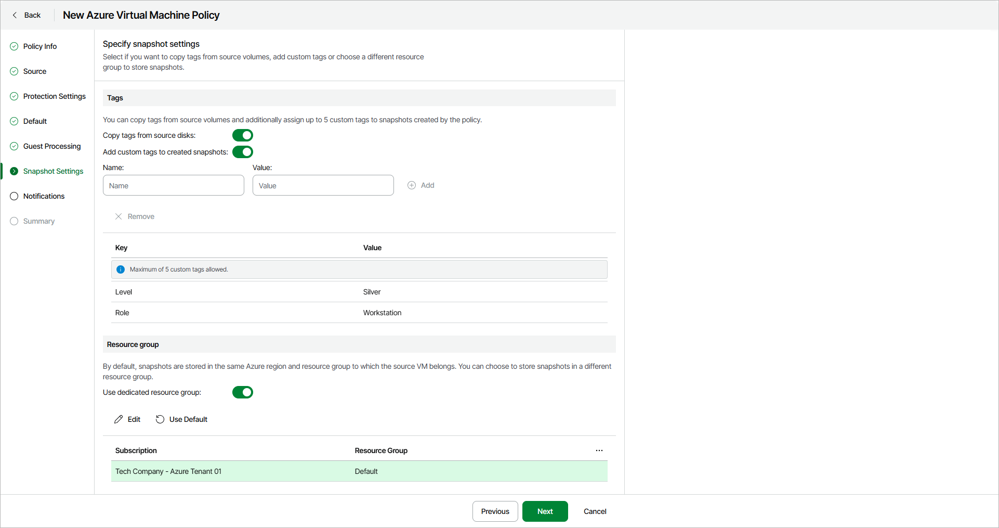

# Step 7. Specify Snapshot Settings

The Snapshot Settings step of the wizard is available if you have enabled the advanced settings configuration at the [Summary](azure_backup_create_vm_review.md) step of the wizard.

Specify how you want to manage the created snapshots:

1. In the Tags section, do the following:

1. Turn on the Copy tags from source disks toggle If you want to copy existing tags to created snapshots.
2. Turn on the Add custom tags to created snapshots to assign custom tags to created snapshots.

Specify a key and its value for the tag and click Add. Repeat this for each tag that you want to assign to created snapshots. You can assign up to 5 custom tags in addition to tags assigned to source volumes.

1. Turn on the Use dedicated resource group toggle in the Resource group section if you want to specify a resource group, different from the default one, to store the created snapshots. Then, do the following:

1. Click Edit.
2. In the Snapshot resource group settings window, select a resource group and click Apply.

If you want to keep the snapshots in the default resource group, skip this step.

