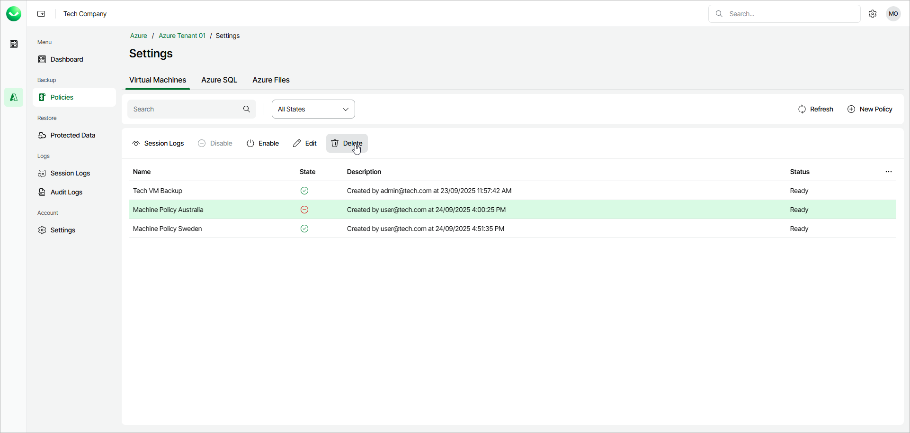

# Deleting Backup Policies

In this article

You can delete a backup policy if you do not need it anymore.

To delete a backup policy, do the following:

1. Open the Policies page.
2. In the policies list, select the required policy and click Delete or right-click the policy and select Delete.

Page updated 10/15/2025
