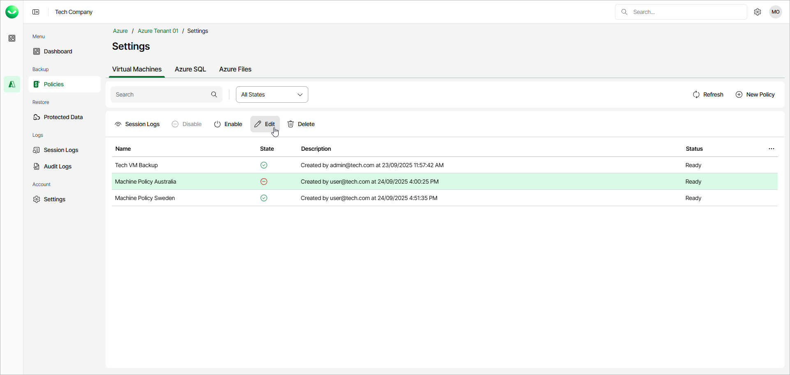

# Editing Backup Policy Settings

You can modify settings configured while creating a policy:

1. Open the Policies page. In the policies list, select the required policy and click Edit or right-click the policy and select Edit.
2. Edit the backup policy settings as described in sections [Creating VM Backup Policy](azure_backup_create_vm.md), [Creating SQL Backup Policy](azure_backup_create_sql.md) or [Creating Azure Files Backup Policy](azure_backup_create_files.md).

