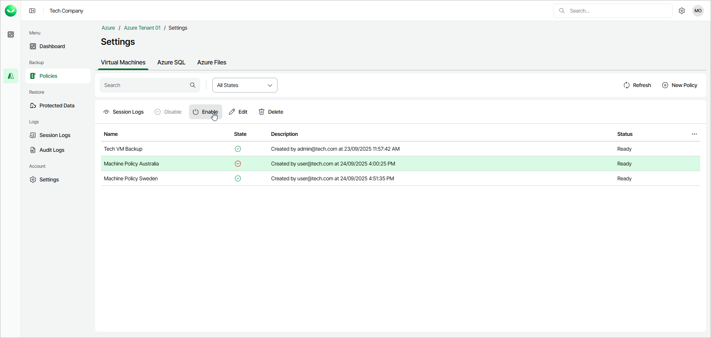

# Enabling and Disabling Backup Policies

In this article

Veeam Data Cloud for Microsoft Azure runs all created backup policies according to the specified schedules. However, you can temporarily disable a backup policy if you do not want to run the backup policy automatically.

To enable or disable a backup policy, do the following:

1. Open the Policies page.
2. In the policies list, select the required policy and click Enable/Disable or right-click the policy and select Enable/Disable.

Page updated 10/15/2025
