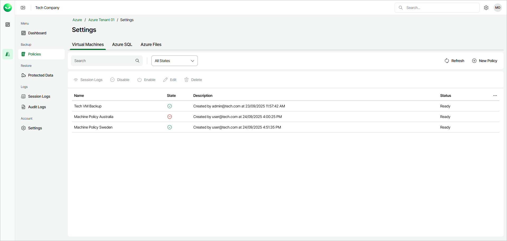

# Viewing Backup Policies

To view the list of all policies, open the Policies page in the Backup section of the main menu and select the Virtual Machines, Azure SQL or Azure Files tab — depending on the type of the policies you want to view.

For each backup policy, Veeam Data Cloud for Microsoft Azure displays the following properties:

* Name — the name of the backup policy.
* State — the current state of the backup policy.
* Description — the description of the backup policy.
* Status — the status of the backup policy.

To narrow down the list of displayed backup policies, you can filter policies by name or state:

* In the Search field, specify the name or a part of the name of the policy that you want to display.
* From the All States drop-down list, select a state of the backup policy. Veeam Data Cloud for Microsoft Azure will display the policies in this state.

To view detailed policy information, select the required policy and click View Info or right-click the policy and select View Info.

