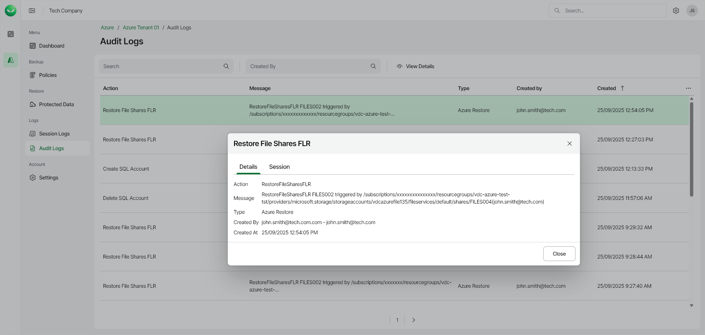

# Viewing Audit Logs

In this article

To view the list of all user actions, open the Audit Logs page in the Logs section of the main menu. To view user action details, right-click a selected action and choose View Details.

Page updated 12/15/2025
