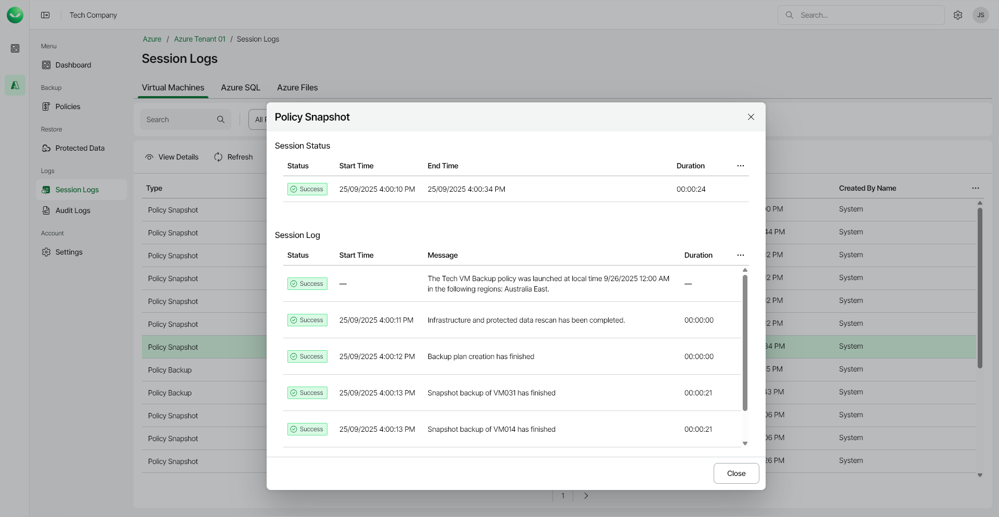

# Viewing Session Logs

In this article

To view the list of all backup sessions, open the Session Logs page in the Logs section of the main menu. To view session details, right-click a selected session and choose View Details.

Page updated 12/15/2025
