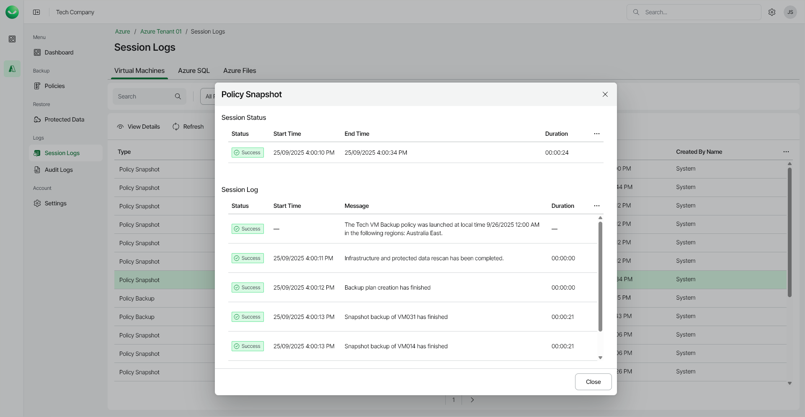

# Viewing Session Logs

To view the list of all backup sessions, open the Session Logs page in the Management section of the main menu. To view session details, right-click a selected session and choose View Details.

