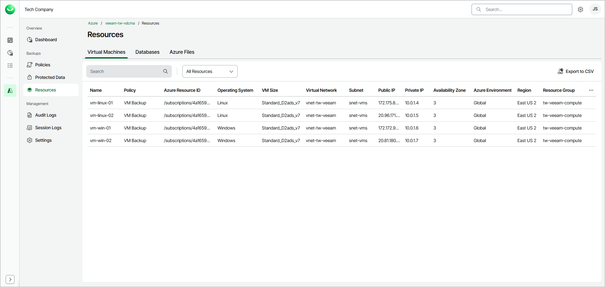
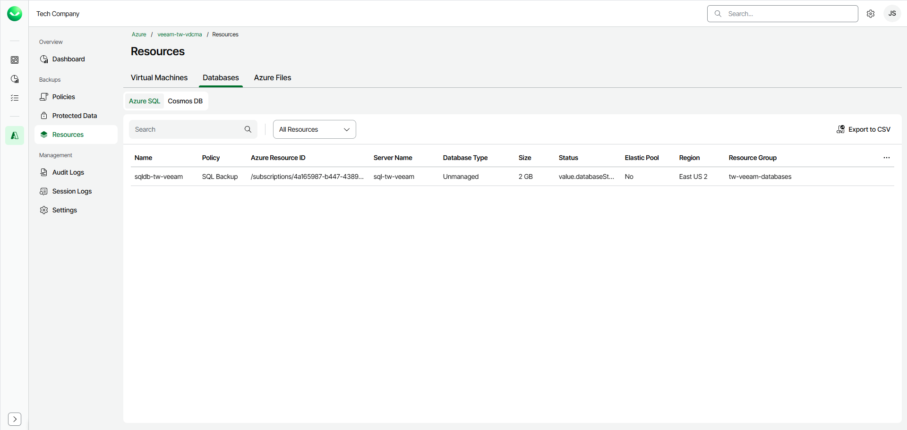
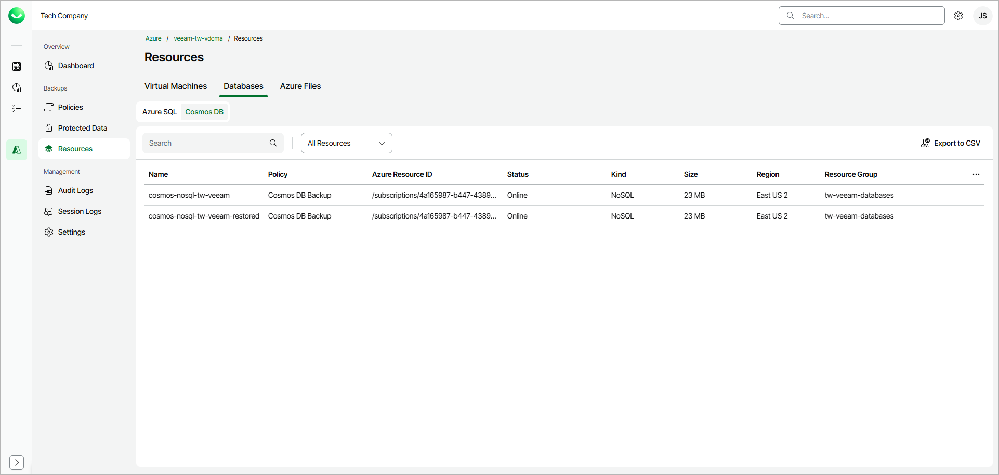
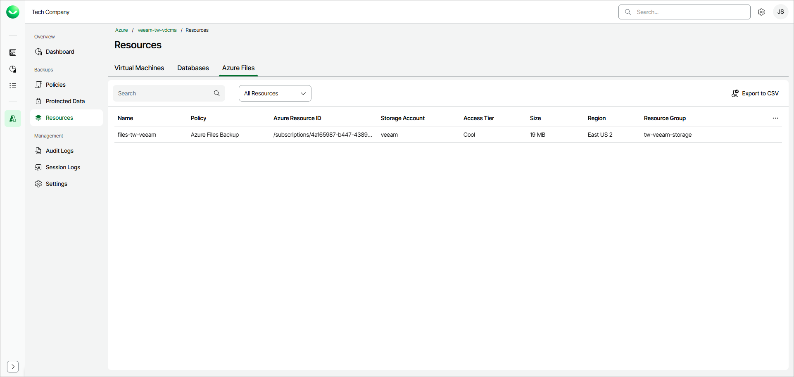

# Viewing Available Resources

After you create a backup policy to protect a specific type of Azure resources, Veeam Data Cloud rescans Azure regions specified in the policy settings and populates the resource list on the Resources page with all resources of that type residing in these regions. If a region is no longer specified in any backup policy, Veeam Data Cloud removes resources residing in the region from the list of available resources.

To view the list of all Azure resources discovered by Veeam Data Cloud, open the Resources page in the main menu and select the [Virtual Machines](azure_resources_view.md), [Databases](azure_resources_view.md#dbs) or [Azure Files](azure_resources_view.md#files) tab — depending on the type of the resources you want to view.

Virtual Machines

For each virtual machine, Veeam Data Cloud displays the following properties:

* Name — the name of the virtual machine.
* Policy — the name of the backup policy that protects the virtual machine.
* Azure Resource ID — the Azure resource identifier of the virtual machine.
* Operating System — the operating system installed on the virtual machine.
* VM Size — the size of the virtual machine.
* Virtual Network — the virtual network to which the virtual machine is connected.
* Subnet — the subnet to which the virtual machine is connected.
* Public IP — the public IP address of the virtual machine.
* Private IP — the private IP address of the virtual machine.
* Availability Zone — the availability zone in which the virtual machine is located.
* Azure Environment — the Azure environment in which the virtual machine is located.
* Region — the Azure region in which the virtual machine is located.
* Resource Group — the Azure resource group to which the virtual machine belongs.

Databases

On the Databases tab, select the Azure SQL or Cosmos DB sub-tab depending on the type of databases you want to view.

For each Azure SQL database, Veeam Data Cloud displays the following properties:

* Name — the name of the database.
* Policy — the name of the backup policy that protects the database.
* Azure Resource ID — the Azure resource identifier of the database.
* Server Name — the name of the server that hosts the database.
* Database Type — the type of the database.
* Size — the size of the database.
* Status — the status of the database.
* Elastic Pool — indicates whether the database belongs to an elastic pool.
* Region — the Azure region in which the database is located.
* Resource Group — the Azure resource group to which the database belongs.

For each Cosmos DB account, Veeam Data Cloud displays the following properties:

* Name — the name of the Cosmos DB account.
* Policy — the name of the backup policy that protects the Cosmos DB account.
* Azure Resource ID — the Azure resource identifier of the Cosmos DB account.
* Status — the status of the Cosmos DB account.
* Kind — the API kind of the Cosmos DB account (for example, NoSQL).
* Size — the size of the Cosmos DB account.
* Region — the Azure region in which the Cosmos DB account is located.
* Resource Group — the Azure resource group to which the Cosmos DB account belongs.

Azure Files

For each Azure file share, Veeam Data Cloud displays the following properties:

* Name — the name of the file share.
* Policy — the name of the backup policy that protects the file share.
* Azure Resource ID — the Azure resource identifier of the file share.
* Storage Account — the storage account that hosts the file share.
* Access Tier — the access tier of the file share.
* Size — the size of the file share.
* Region — the Azure region in which the file share is located.
* Resource Group — the Azure resource group to which the file share belongs.

Filtering Resources

To narrow down the list of displayed resources, you can filter resources by name or protection status:

* In the Search field, specify the name or a part of the name of the resource that you want to display.
* From the All Resources drop-down list, select Protected or Unprotected to display only the resources with the required protection status.

Exporting Resources to CSV

To export the list of resources to a CSV file, click Export to CSV. Veeam Data Cloud will save the file to the default download location on your machine.

