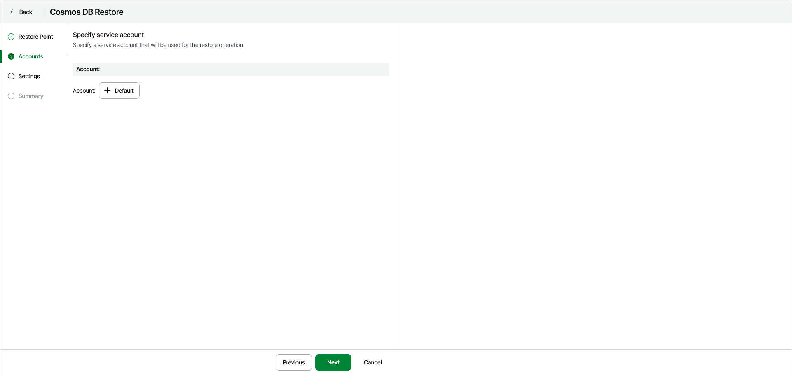

# Step 3. Specify Account

At the Accounts step of the wizard, make sure the Default Azure account is selected. This is the Veeam service principal account that was created by Veeam Data Cloud for Microsoft Azure. This account has all the necessary roles and permissions for the restore operation.

