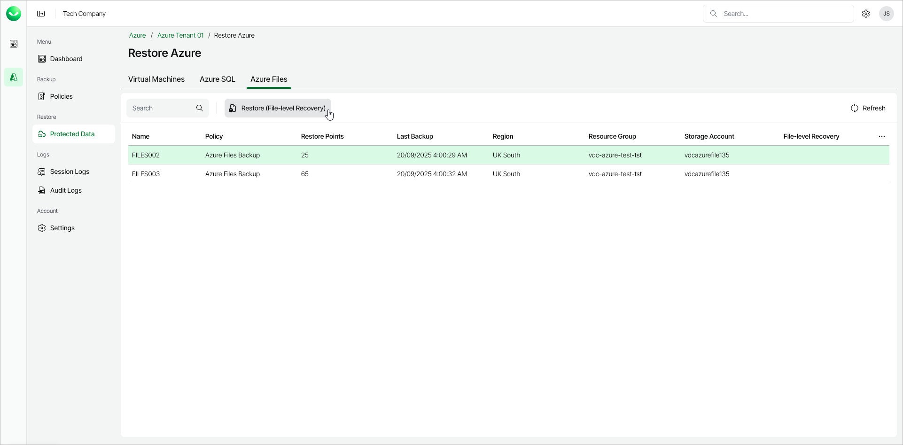

# Step 1. Launch File-Level Recovery Wizard

To launch the File-Level Recovery wizard, do the following:

1. In the Restore section of the main menu, open the Protected Data page and select the Azure Files tab.
2. Select the Azure file share whose files you want to restore.

|  |
| --- |
| Note |
| You can restore files from only one Azure file share within a single restore operation. |

1. Click Restore (File-level Recovery). Alternately, right-click the selected file share and, in the context menu, choose Restore (File-level Recovery).

