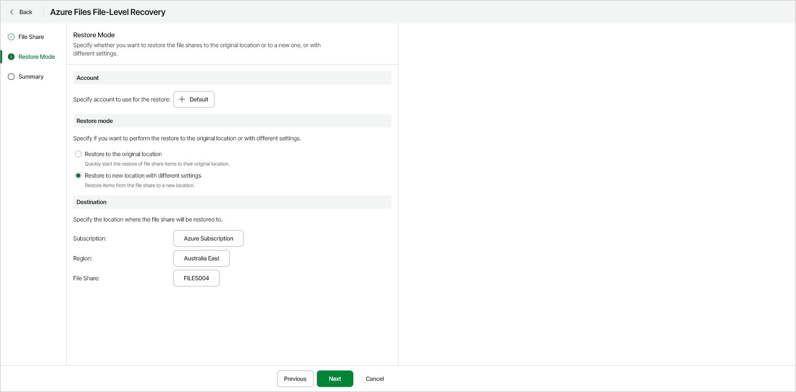

# Step 3. Specify Account and Restore Mode

In this article

At the Restore Mode step of the wizard, specify the following restore settings:

* [Azure account](#account)
* [Restore mode and destination](#mode)

Specifying Azure Account

To select the account whose permissions Veeam Data Cloud for Microsoft Azure will use to perform the restore operation, do the following:

1. Click Select account.
2. In the Select Account window, select an Azure account that you want to use for the restore procedure.

Specifying Restore Mode and Destination

In the Restore Mode section, choose whether you want to restore files from the selected file share to the original or to a custom location.

If you select the Restore to new location with different settings option, you must also select an Azure subscription, region and target file share in which the restored Azure VM will reside. To do this, in the Destination section, perform the following steps:

1. From the Subscription drop-down list, select the necessary Azure subscription.

For a subscription to be displayed in the list of available subscriptions, it must be [created](https://learn.microsoft.com/en-us/azure/cost-management-billing/manage/create-subscription) in Microsoft Azure and [associated](https://docs.microsoft.com/en-us/azure/active-directory/fundamentals/active-directory-how-subscriptions-associated-directory) with the Microsoft Entra tenant to which the specified service account belongs.

1. From the Region drop-down list, select an Azure region.
2. Click File Share and select a file share in the Choose file share window.

|  |
| --- |
| Note |
| Data transfer to a new location may result in additional costs and may take more time to complete. |

Page updated 12/15/2025
