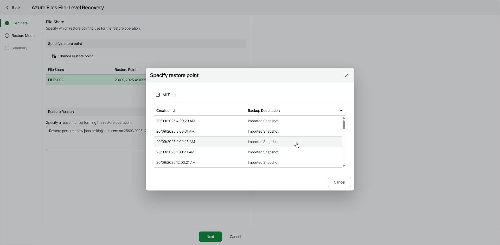

# Step 2. Select Restore Point

In this article

At the File Share step of the wizard, select a restore point that will be used to restore files from the selected Azure file share, as well as a reason for restore.

By default, Veeam Data Cloud for Microsoft Azure uses the most recent valid restore point. However, you can select any previous restore point to restore files to a specific earlier state.

To select a specific restore point, do the following:

1. In the Specify file share to restore section, select an Azure file share and click Change Restore Point.
2. In the Specify restore point window, select the necessary restore point.

|  |
| --- |
| Tip |
| You can filter the list of restore points by selecting a backup date range. |

1. In the Restore reason field, by default, Veeam Data Cloud for Microsoft Azure displays the current user and time stamp.

You can edit the information in this field. This information will be saved to the session history, and you will be able to reference it later.

Page updated 12/15/2025
