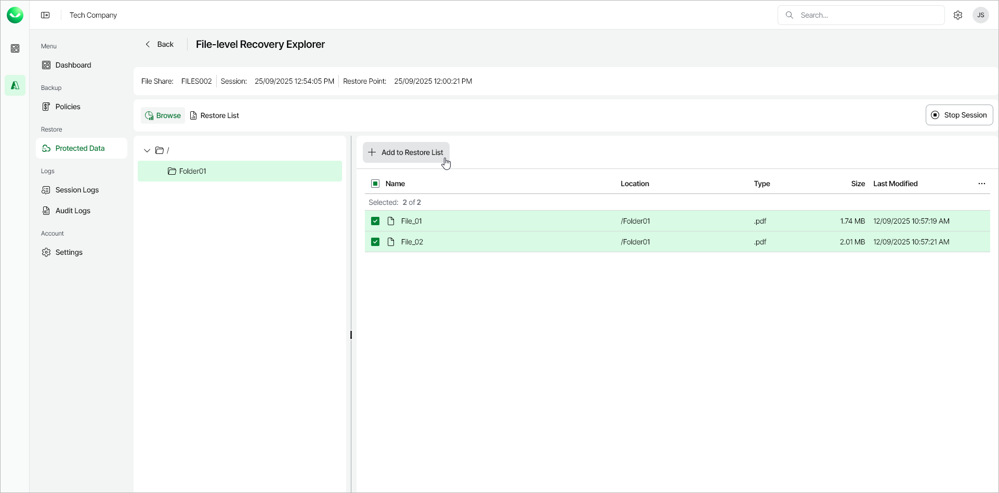
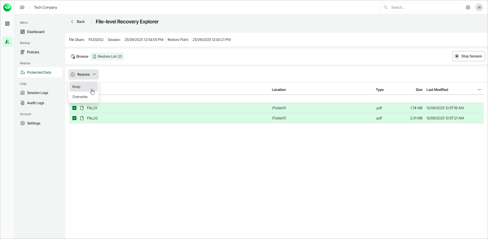

# Step 5. Select Files to Restore

In this article

In the File-Level Recovery Explorer, you can browse and recover files and folders of the selected Azure Files share. All restored items will be saved to the specified target file share.

To recover files and folders from a specific folder, perform the following steps:

1. On the Browse tab, select the location of the files and folders that you want to restore:

1. Select a volume and navigate to the folder that contains the necessary files and folders.
2. In the working area, select check boxes next to the necessary items and click Add to Restore List.

1. Switch to the Restore List tab, review the list of files and folders, select check boxes next to the items that you want to recover and do the following:

* To restore copies of the selected files and folders to the target file share, click Restore > Keep.

If files and folders with the same names exist on the target file share, Veeam Data Cloud for Microsoft Azure will save the selected files to this file share using the following naming format: <file\_name>-Copy<ordinal\_number>. Otherwise, Veeam Data Cloud for Microsoft Azure will save the selected files to this file share with their original names.

* To restore the selected files and folders to the target file share, click Restore > Overwrite.

If files and folders with the same names already exist on the target file share, Veeam Data Cloud for Microsoft Azure will overwrite these files. Otherwise, Veeam Data Cloud for Microsoft Azure will save the selected files to this file share.

As soon as you click Restore, Veeam Data Cloud for Microsoft Azure will save the selected files to the target file share.

Page updated 12/15/2025
