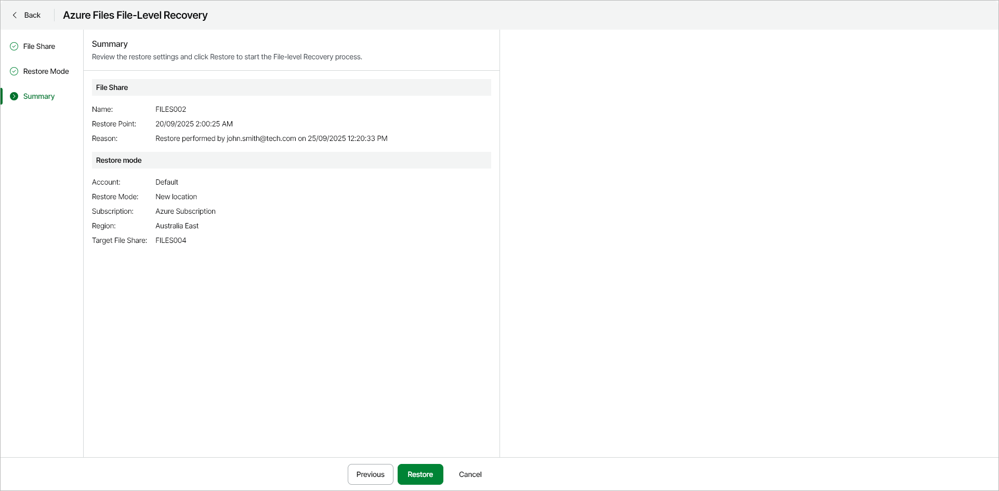
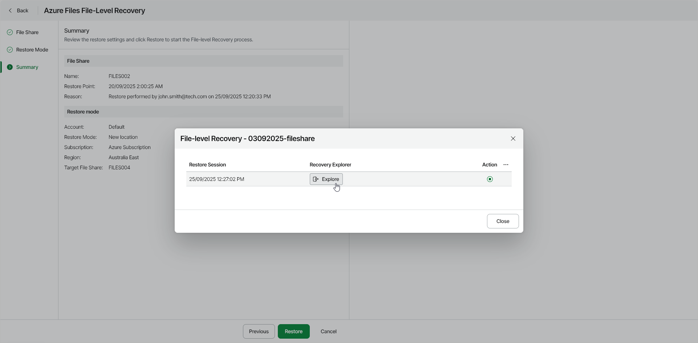

# Step 4. Start Restore Session

At the Summary step of the wizard, review the summary information and start the restore session.

1. Click Restore.

Veeam Data Cloud for Microsoft Azure will start the restore session. After the restore point is mounted and ready for browsing, Veeam Data Cloud for Microsoft Azure will generate a link to the File-Level Recovery Explorer.

You can stop the running session any time by clicking the Stop session icon in the File-Level Recovery window.

1. In the File-Level Recovery window, click Explore.

