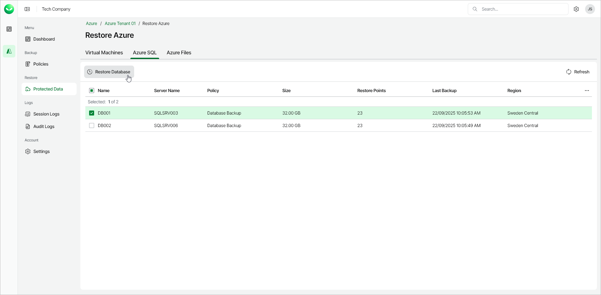

# Step 1. Launch SQL Database Restore Wizard

To launch the SQL Database Restore wizard, do the following:

1. In the Restore section of the main menu, open the Protected Data page and select the Azure SQL tab.
2. Select the Azure SQL database that you want to restore.

|  |
| --- |
| Note |
| You can select one or more Azure SQL databases to restore. If you select more than one database, all selected databases must belong to the same SQL Server. |

1. Click Restore Database. Alternately, right-click the selected database and, in the context menu, choose Restore Database.

