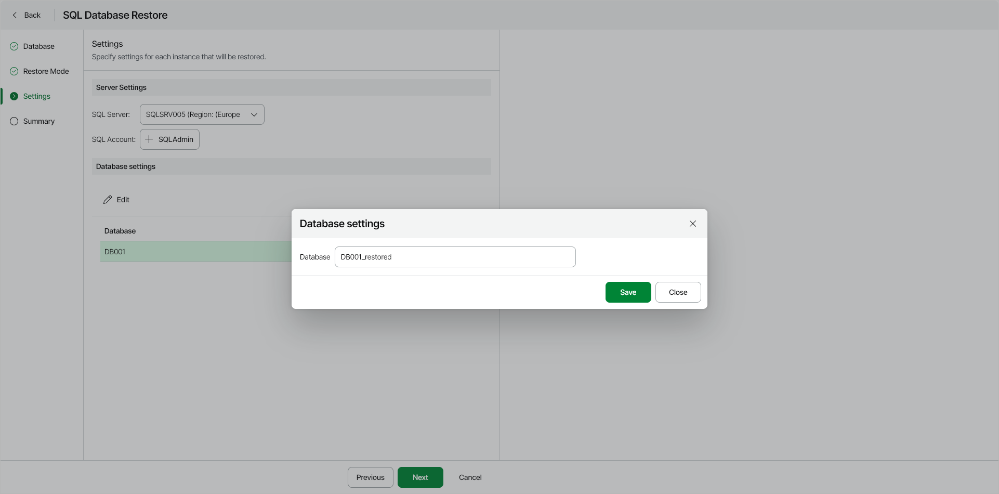

# Step 4. Specify Restore Settings

At the Settings step of the wizard, you can specify the following:

* [Azure Service Account or Entra ID Application that Veeam Data Cloud for Microsoft Azure will use to perform the restore operation](#auth)
* [Settings for the SQL Server that will host the restored database](#restore)

|  |
| --- |
| Note |
| If you restore multiple databases, the SQL Server settings you specify will apply to all databases in the restore scope. |

* [New names for the restored databases](#rename)

Specifying Authentication Method

To specify the authentication method to connect to the SQL server, select one of the following options:

* Username and Password — select this option to use an Azuse SQL account. In the SQL Account section, click Select account and choose the necessary SQL account.

* Entra ID Application — select this option to use an Entra ID application.

To enable Microsoft Entra ID authentication, the Azure SQL Server must have your [Azure Service Account](azure_settings_accounts_service_view.md) application ID configured as its Entra ID administrator. You can set the Entra ID administrator in the settings of the Azure SQL Server in the Azure portal. To learn more, see [Microsoft documentation](https://learn.microsoft.com/en-us/azure/azure-sql/database/authentication-aad-configure?view=azuresql&tabs=azure-portal).

Specifying SQL Server Settings

To specify settings for the target SQL Server that will host the restored database, do the following:

1. From the SQL Server list, select a target SQL server.

|  |
| --- |
| Note |
| The target SQL Server must belong to the same region as the restored database. |

1. Click Select SQL Account and in the Select SQL Account window, choose an account that will be used to authenticate against the target SQL Server.

Renaming Restored Databases

To specify a new name for each Azure SQL database you want to restore, do the following:

1. In the Database Settings section, select a database and click Edit.
2. In the Database Settings window, in the Instance field, specify a new name for the database.
3. After you specify a new name for the restored Azure SQL database, click Save.

