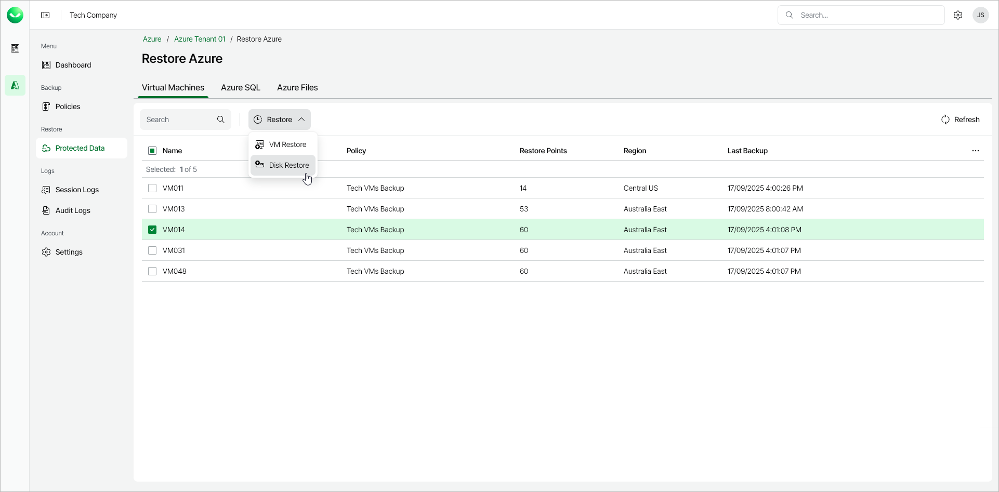

# Step 1. Launch Restore Virtual Machine Disks Wizard

To launch the Restore Virtual Machine Disks wizard, do the following:

1. In the Restore section of the main menu, open the Protected Data page.
2. On the Virtual Machines tab, select the Azure VM whose disks you want to restore.

|  |
| --- |
| Note |
| You can restore disks of only one Azure VM within a single restore session. |

1. Click Restore > Disk Restore. Alternately, right-click the selected VM and, in the context menu, choose Restore > Disk Restore.

