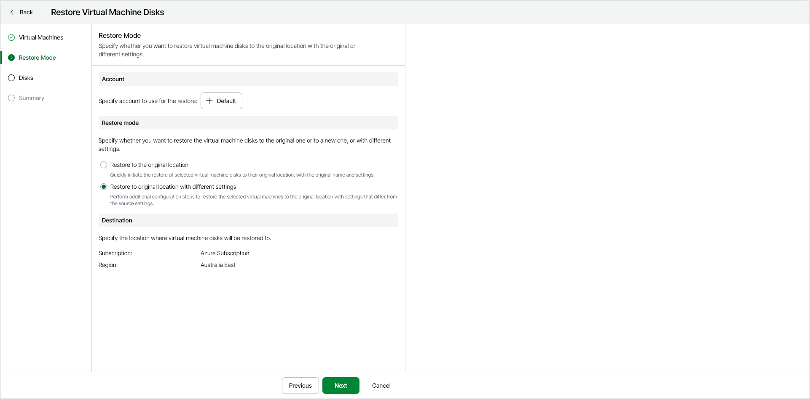

# Step 3. Select Account and Restore Mode

In this article

At the Restore Mode step of the wizard, specify the following restore settings:

* [Azure account](#account)
* [Restore mode and destination](#mode)

Specifying Azure Account

To select the account whose permissions Veeam Data Cloud for Microsoft Azure will use to perform the restore operation, do the following:

1. In the Account section, click Select Account.
2. In the Select Account window, select an Azure account that you want to use for the restore operation.

Specifying Restore Mode and Destination

|  |
| --- |
| Note |
| You can restore VM disks to their original location only. |

In the Restore mode section, select one of the following options:

* Restore to the original location — select this option to restore VM disks with their original names and settings.
* Restore to original location with different settings — select this option to restore VM disks with different names or settings. If you choose this option, the Restore Virtual Machines wizard will display an additional step - [Settings](azure_restore_vm_disks_settings.md). At this step, you can specify new settings for the restored VM disks.

Page updated 12/15/2025
