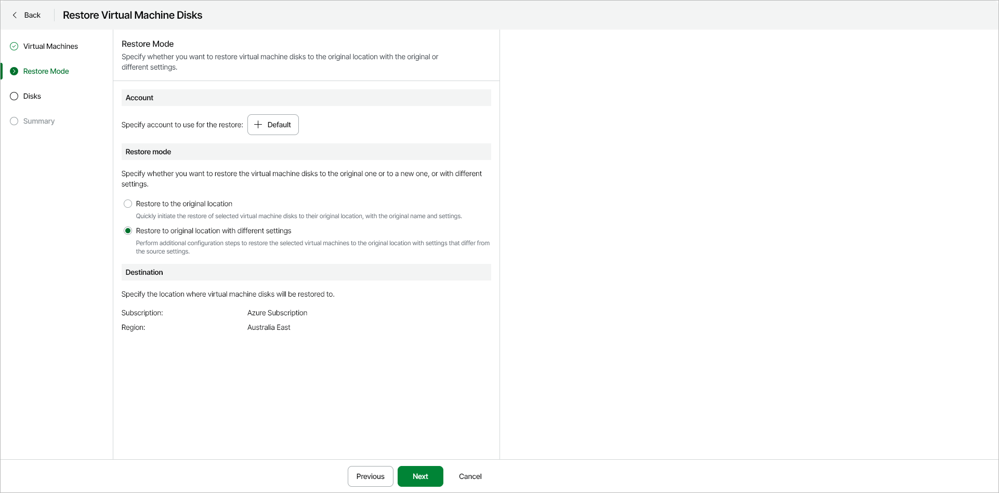

# Step 3. Select Account and Restore Mode

At the Restore Mode step of the wizard, specify the following restore settings:

* [Azure account](#account)
* [Restore mode and destination](#mode)

Specifying Azure Account

Make sure the Default Azure account is selected. This is the Veeam service principal account that was created by Veeam Data Cloud for Microsoft Azure. This account has all the necessary roles and permissions for the restore operation.

Specifying Restore Mode and Destination

|  |
| --- |
| Note |
| You can restore VM disks to their original location only. |

In the Restore mode section, select one of the following options:

* Restore to the original location — select this option to restore VM disks with their original names and settings.
* Restore to original location with different settings — select this option to restore VM disks with different names or settings. If you choose this option, the Restore Virtual Machines wizard will display an additional step - [Settings](azure_restore_vm_disks_settings.md). At this step, you can specify new settings for the restored VM disks.

