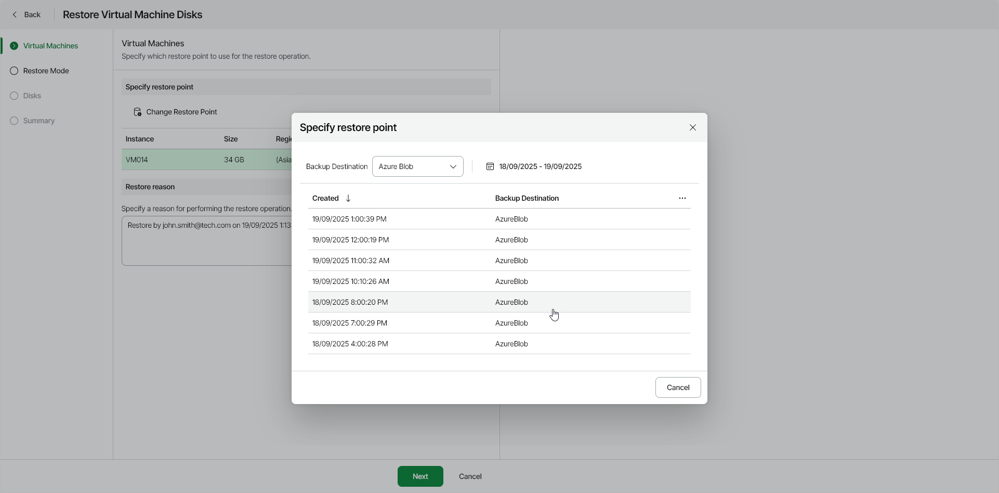

# Step 2. Select Restore Point

At the Virtual Machines step of the wizard, select a restore point that will be used to restore VM disks and specify a reason for restore.

By default, Veeam Data Cloud for Microsoft Azure uses the most recent valid restore point. However, you can restore the Azure VM data to an earlier state.

To select a specific restore point, do the following:

1. In the Specify restore point section, select the VM whose disks you want to restore and click Change Restore Point.
2. In the Specify restore point window, select the necessary restore point.

|  |
| --- |
| Tip |
| You can filter the list of restore points by selecting the backup date range or destination. |

1. In the Restore reason field, by default, Veeam Data Cloud for Microsoft Azure displays the current user and time stamp.

You can edit or replace the information in this field. This information will be saved to the session history, and you will be able to reference it later.

