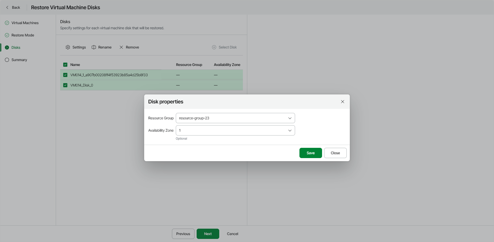
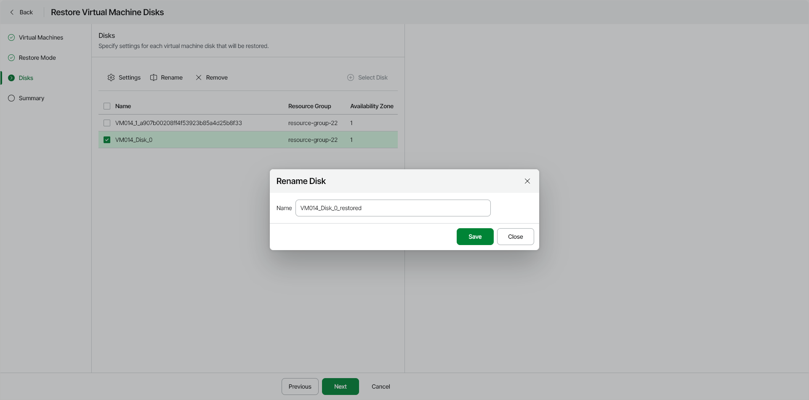

# Step 4. Specify Disk Settings

In this article

|  |
| --- |
| Important |
| You can specify new settings for the restored disks only if you have selected the Restore to original location with different settings option at the [Restore Mode](azure_restore_vm_disks_mode.md) step of the wizard. |

At the Disks step of the wizard, you must [configure target resource group settings](#rg) for each restored disk. You can also [rename restored disks](#rename) and [remove disks](#remove) that you don't want to restore.

Specifying Resource Group Settings

To specify settings for the target resource group, do the following:

1. Select one or more disks and click Settings.

|  |
| --- |
| Note |
| The settings you specify will apply to all the selected disks. You can specify different settings for different disks. Make sure you configure settings for all the disks that you want to restore. |

1. In the Disk properties window, do the following:

1. From the Resource group drop-down list, select a resource group for the restored virtual disk.

For a resource group to be displayed in the list of available resource groups, it must be created in the Microsoft Azure portal as described in [Microsoft Docs](https://docs.microsoft.com/en-us/azure/azure-resource-manager/management/manage-resource-groups-portal).

1. From the Availability Zone drop-down list, select an availability zone to which you want to place the restored virtual disk.

1. After you make changes to the virtual disk settings, click Save.

Renaming Restored Virtual Disks

If you want to specify a new name for a restored disk, do the following:

1. Select a disk and click Rename.
2. In the Rename Disk window, type in a new name for the disk and click Save.

Removing Disks from Restore Scope

You can remove disks that you do not want to restore from the scope of the current restore operation. To do this, select one or more disks and click Remove.

To re-add a removed disk to the scope of restore, click Select Disk; then in the Select Disks window, choose a disk that you want to restore. The disk will be added to the list of disks to restore. Select the disk to [specify properties](#rg).

Page updated 12/15/2025
