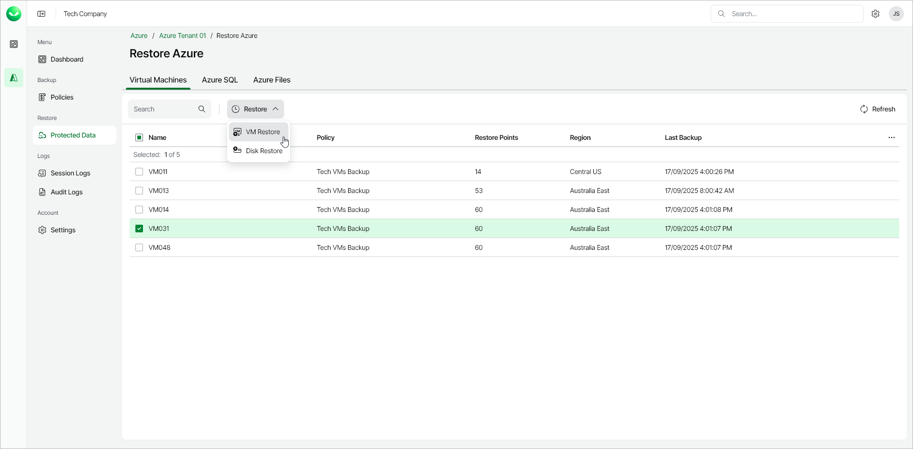

# Step 1. Launch Restore Virtual Machines Wizard

To launch the Restore Virtual Machines wizard, do the following:

1. In the Restore section of the main menu, select Protected Data.
2. On the Virtual Machines tab, select the Azure VM that you want to restore.

|  |
| --- |
| Note |
| You can select one or multiple Azure VMs to restore. To select all the protected Azure VMs for restore, select the check box next to the Name column header. |

1. Click Restore > VM Restore. Alternately, right-click your selection and, in the context menu, choose Restore > VM Restore.

