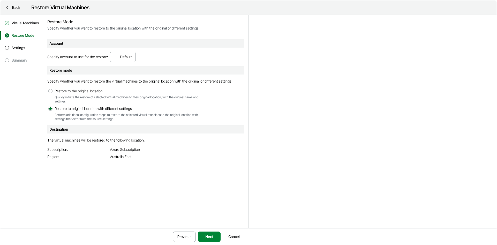

# Step 3. Select Account and Restore Mode

At the Restore Mode step of the wizard, specify the following restore settings:

* [Azure account](#account)
* [Restore mode and destination](#mode)

Specifying Azure Account

Make sure the Default service account is selected. This is the Veeam service principal account that was created by Veeam Data Cloud for Microsoft Azure. This account has all the necessary roles and permissions for the restore operation.

Specifying Restore Mode and Destination

In the Restore mode section, select one of the following options:

* Restore to the original location — select this option to restore the VM to its original location with the original name and settings.
* Restore to new location with different settings — select this option to restore the VM to a new location with a different name or settings. If you select this option, you must specify the restore destination, including the Azure subscription and region. The Restore Virtual Machines wizard then includes an additional [Settings](azure_restore_vm_entire_settings.md) step where you can specify the new settings for the restored VM.

Page updated 2026-07-21
