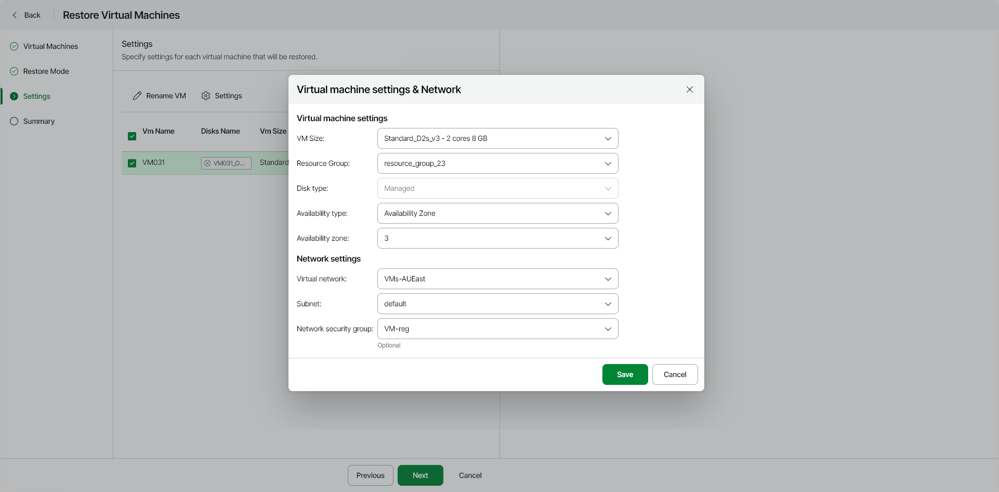
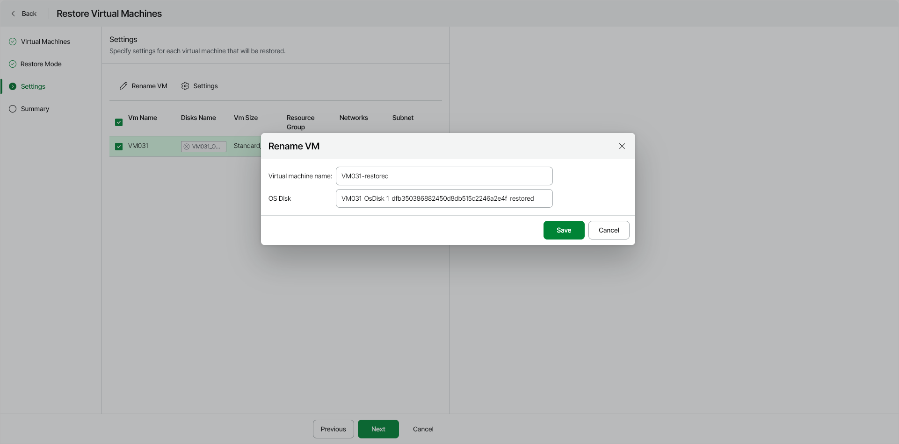

# Step 4. Specify VM and Network Settings

|  |
| --- |
| Important |
| This step is available only if you have selected the Restore to original location with different settings option at the [Restore Mode](azure_restore_vm_entire_mode.md) step of the wizard. |

At the Settings step of the wizard, you can specify the following:

* [Instance and network settings for the restored VM](#restore)
* [New names for the restored VM and virtual disks](#rename)

Specifying Instance and Network Settings

To specify settings for a restored VM, do the following:

1. In the Settings & Disks section, make sure you selected the VM whose settings you want to change and click Settings.

Veeam Data Cloud for Microsoft Azure will display the Virtual machine settings & Network window.

1. In the Virtual machine settings section, specify settings for the restored Azure VM:

1. From the VM Size drop-down list, select size for the restored Azure VM. For more information on VM sizes, see [Microsoft Docs](https://docs.microsoft.com/en-us/azure/virtual-machines/linux/sizes-general).

|  |
| --- |
| Important |
| If the size of the original Azure VM differs from the size of the restored VM, Microsoft Azure may apply additional charges for maintaining the restored VM. |

1. From the Resource Group drop-down list, select a resource group to which the restored Azure VM will belong.

For a resource group to be displayed in the Resource Group list, it must be created in the Microsoft Azure portal as described in [Microsoft Docs](https://docs.microsoft.com/en-us/azure/azure-resource-manager/management/manage-resource-groups-portal).

1. [Optional] From the Disk type drop-down list, select a type of virtual disks that will be attached to the restored Azure VM. For more information on disk types, see [Microsoft Docs](https://docs.microsoft.com/en-us/azure/virtual-machines/windows/managed-disks-overview).

1. [Optional] Use the Availability type drop-down list to choose whether you want to include the restored Azure VM in an availability set or to place the VM in an availability zone.

Availability sets allow you to distribute VMs across multiple physical hardware resources. Availability zones allow you to distribute VMs across multiple unique physical locations and to protect your data from datacenter failures. For more information on availability options for virtual machines in Azure, see [Microsoft Docs](https://docs.microsoft.com/en-us/azure/virtual-machines/linux/availability).

1. In the Network settings section, specify the virtual network settings for the restored Azure VM:

1. From the Virtual network drop-down list, select a virtual network to which you want to connect the restored Azure VM. For a virtual network to be displayed in the Virtual network list, it must be created in the Microsoft Azure portal as described in [Microsoft Docs](https://docs.microsoft.com/en-us/azure/virtual-network/manage-virtual-network).
2. From the Subnet drop-down list, select the subnet of the specified virtual network. For a subnet to be displayed in the Subnet list, it must be created within the selected virtual network as described in [Microsoft Docs](https://docs.microsoft.com/en-us/azure/virtual-network/virtual-network-manage-subnet).
3. [Optional] From the Network security group drop-down list, you can select a security group (virtual firewall) that will be associated with the restored Azure VM. Security groups are used to filter network inbound traffic to and outbound traffic from Azure resources. Each security group contains a set of rules that control the traffic. For a network security group to be displayed in the Network security group list, it must be created in the Microsoft Azure portal as described in [Microsoft Docs](https://docs.microsoft.com/en-us/azure/virtual-network/tutorial-filter-network-traffic#create-a-network-security-group).

1. After you specify the necessary settings, click Save.

Renaming VM and Virtual Disks

To specify a new name for the restored Azure VM, as well as for each restored virtual disk, do the following:

1. In the list of VMs to restore, select the VM whose properties you want to change and click Rename VM.
2. In the Rename virtual machine window, specify the following:

1. In the Virtual machine name, specify a new name for the restored Azure VM.

|  |
| --- |
| Important |
| The maximum allowed length of the restored VM name is 15 characters for Windows VMs and 64 characters for Linux VMs. If the VM name exceeds this limit, the restore operation fails. |

1. In the field for disk name, specify a new name for each virtual disk.

1. After you specify new names for the restored Azure VM and its virtual disks, click Save.

