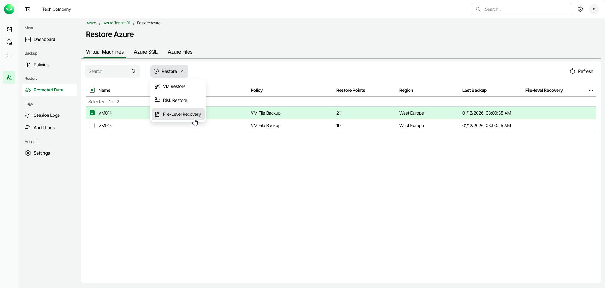

# Step 1. Launch File-Level Recovery Wizard

To launch the File-Level Recovery wizard, do the following:

1. In the Restore section of the main menu, open the Protected Data page.
2. On the Virtual Machines tab, select the Azure VM whose files you want to restore.

|  |
| --- |
| Note |
| You can restore files from only one Azure VM within a single restore operation. |

1. Click Restore > File-Level Recovery. Alternately, right-click the selected VM and, in the context menu, choose Restore > File-Level Recovery.

