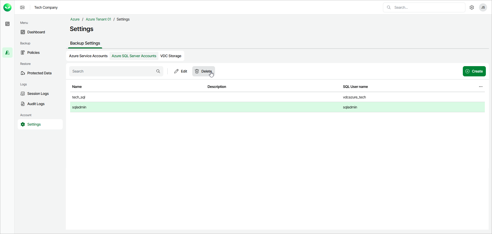

# Deleting Database Account

In this article

You can remove a SQL server account from the configuration database if you no longer need it.

|  |
| --- |
| Important |
| You cannot remove a database account that is associated with any backup policy. To remove such an account, you must first delete all of the affected policies or edit their settings. |

To delete a SQL server account from Veeam Data Cloud for Microsoft Azure, do the following:

1. In the Account section of the main menu, select Settings.
2. On the Azure SQL Server Accounts tab, select the account you want to delete and click Delete.
3. In the Delete Azure Sql Account dialog window, click Delete.

Page updated 10/15/2025
