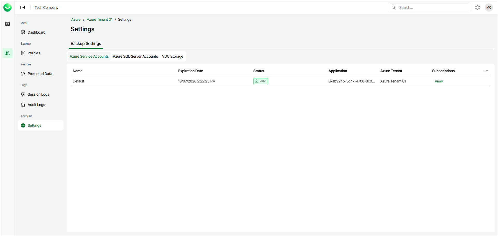
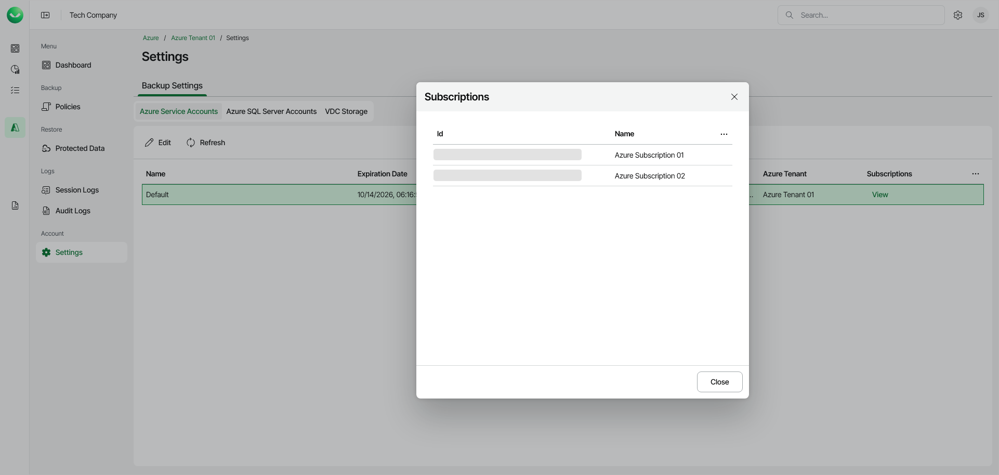

# Viewing Azure Service Accounts

When you connect Veeam Data Cloud to your Azure tenant account, Veeam Data Cloud creates an Azure application that acts as a service principal in your tenant. Veeam Data Cloud uses this service account to protect your resources.

The Azure Service Accounts tab displays information about the Veeam Data Cloud service account.

To see the list of enabled subscriptions, click View.

