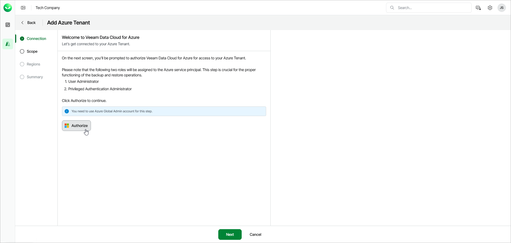

# Step 2. Connect to Azure Tenant

At the Connection step of the wizard, log in to your Microsoft account to authorize Veeam Data Cloud to access your Azure tenant.

To authorize the access, click Authorize and log in to your Microsoft account.

|  |
| --- |
| Important |
| Make sure to log in with a user account that has the Application Administrator or a more privileged role. For more information about this role, see [Microsoft documentation](https://learn.microsoft.com/en-us/entra/identity/role-based-access-control/permissions-reference#application-administrator). |

After authorization, Veeam Data Cloud will create an Azure application that acts as a service principal in your Azure tenant. Veeam Data Cloud will use this service principal to protect your Azure resources.

