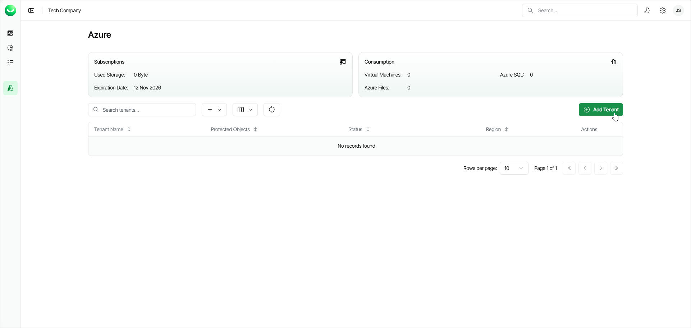

# Step 1. Launch Add Azure Tenant Wizard

In this article

To launch the Add Azure Tenant wizard, on the Azure Management page, click Add Tenant.

|  |
| --- |
| Note |
| If you are a customer of a Veeam Cloud & Service Provider partner, you cannot launch the Add Azure Tenant wizard. Ask your service provider to add your Azure tenant or send you an email with an invitation link that allows you to launch the wizard. |

Page updated 12/10/2025
