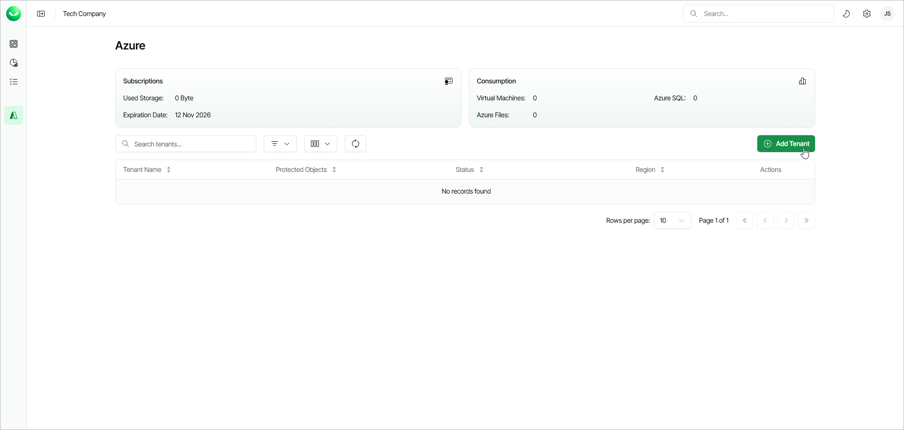

# Step 1. Launch Add Azure Tenant Wizard

To launch the Add Azure Tenant wizard, on the Azure Management page, click Add Tenant.

Alternatively, if your service provider has invited you to add a new tenant, on the Azure Management page, click the menu icon in the Actions column of your invitation and select Activate Invitation.

