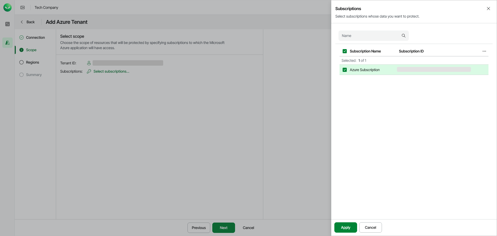

# Step 3. Select Azure Subscription

In this article

At the Scope step of the wizard, select one or multiple Azure subscriptions to define the scope of Azure resources that will be protected by Veeam Data Cloud.

To select a subscription, do the following:

1. At the Scope step of the wizard, click Select subscriptions.
2. In the Subscriptions window, select one or multiple Azure subscriptions.
3. Click Apply.

Page updated 10/20/2025
