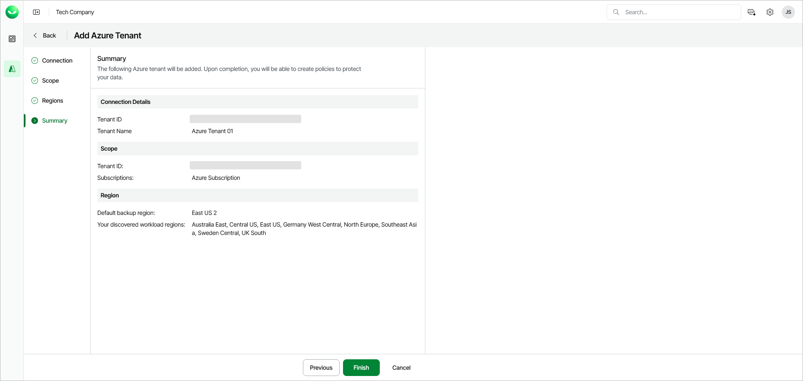

# Step 5. Review Tenant Settings

At the Summary step of the wizard, review the properties of the Azure tenant that you want to add to Veeam Data Cloud.

After you add an Azure tenant, it will appear in the list of workload tenants on the Azure Management page with the Provisioning status. For details on tracking tenant status, see [Viewing Microsoft Azure Tenants](azure_tenant_view.md).

After Veeam provisions backup infrastructure to the tenant, you can access this tenant's management dashboard. For more information, see [Accessing Microsoft Azure Tenant Dashboard](azure_tenant_dashboard.md).

