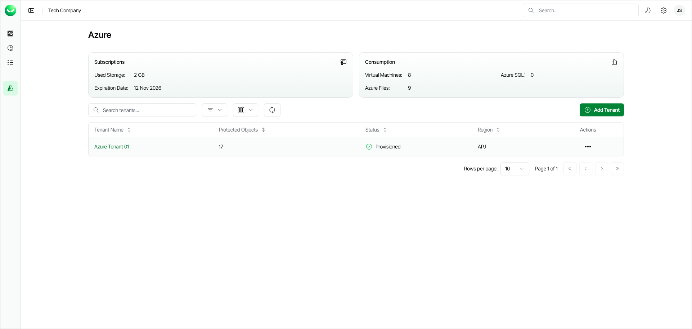

# Viewing Microsoft Azure Tenants

In this article

The Azure Management page provides an overview of your Veeam Data Cloud for Microsoft Azure subscription and backup storage consumption, as well as workload tenants.

Subscription Information

The Subscription section on the Azure Management page displays the following properties:

* Used Storage — The amount of storage space consumed by your backups.
* Expiration Date — The end date of your Veeam Data Cloud subscription.

Consumption Information

The Consumption section on the Azure Management page provides a breakdown of protected Azure resources by type: VM, Azure SQL Server and Azure File Shares.

Workload Tenants

Veeam Data Cloud displays the following properties for each workload tenant:

| Property | Description |
| --- | --- |
| Tenant Name | Name that you specified when adding the tenant. |
| Protected Objects | Total number of Azure resources that Veeam Data Cloud backs up in this tenant. |
| Status | Current status of the tenant. For details, see [Tenant Statuses](#tenantstatuses). |
| Region | Region where Veeam Data Cloud processes and stores backed-up data. |

Tenant Statuses

Each workload tenant can have one of the following statuses:

| Status | Description |
| --- | --- |
| Provisioning | Veeam Data Cloud is provisioning a new tenant with necessary backup infrastructure after you completed the Add Azure Tenant wizard. |
| Provisioned | The infrastructure for your tenant is ready, and you can manage your tenant. To manage a tenant, your account must have the Azure:Administrator role. |
| Provisioning Failed | The infrastructure deployment was not successful. To resolve the issue, [submit a support case](https://my.veeam.com/my-cases). |

Page updated 1/8/2026
