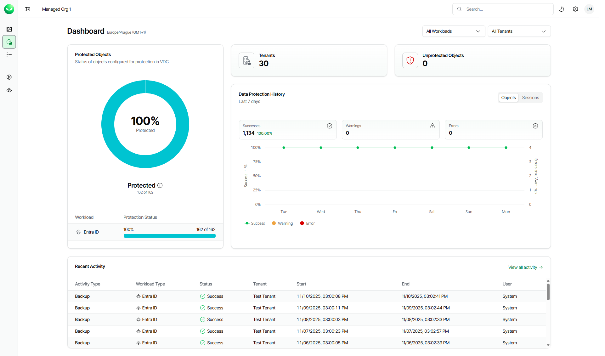

# Organization Dashboard

In this article

The organization dashboard provides a centralized view for monitoring data protection across all workloads in your Veeam Data Cloud organization without the need to access the individual tenants management. The Dashboard page contains information about tenant protection status, the number of protected objects and the recent backup sessions.

The dashboard helps you verify whether the recent data protection activities have been executed correctly. The clear visibility of errors and warnings helps you shorten your response time to issues and simplifies prevention and troubleshooting of potential problems. With the organization dashboard, you can see how much data is backed up and what the current trend is. This can help you to manage your Veeam Data Cloud licenses and provide accurate budget forecasts.

The Dashboard page is available to users with the OrganizationAdmin role assigned.

|  |
| --- |
| Note |
| The Dashboard page currently supports the Microsoft 365, Microsoft Entra ID and Salesforce workloads. |

To view the Dashboard page, click the dashboard icon on the left.

Dashboard Overview

The Dashboard page displays the following sections.

* The Protected Objects section displays the protection status of your workload objects. An object is the smallest unit available for backup. For example, a mailbox or site in a Microsoft 365 workload, or a user, group, or administrative unit in Microsoft Entra ID. An object is considered protected if a restore point has been created within the Recovery Point Objective (RPO) defined by the backup policy schedule assigned to this object.

The protection status is represented as the ratio of protected objects to the total number of objects included in backup policies in Veeam Data Cloud.

* The Tenants section displays the number of tenants that are included in the current view.
* The Unprotected Objects section displays the number of objects for which no restore point has been created within the Recovery Point Objective (RPO) defined by the backup policy schedules assigned to those objects.

* The Data Protection History section displays statistics for backed‑up objects and backup sessions, together with a chart that shows protection activity over the last 7 days. The data is grouped by item status:

* Success — The object was backed up, or the session completed successfully without warnings.
* Warning — The object was not fully backed up, or the session completed with a warning. The Warning status means that an event occurred during the backup session that may or may not prevent the creation of a recovery point for the object.
* Error — The object was not backed up, or the session failed.

Click Objects to display the data protection history for objects. Click Sessions to display the data protection history for backup sessions.

* The Recent Activity section displays the list of the recent backup sessions. To view the complete list, click View all activity. For details, see [Viewing Backup Sessions](activity_backup.md).

Filtering Data

If you want to narrow down the data displayed on the dashboard, you can combine the following filters:

* To configure the scope by workload type, click All Workloads and select one or more workloads.
* To configure the scope by tenant, click All Tenants and select one or more tenants.

To remove the filters and view all data, click Clear All.

Page updated 12/18/2025
