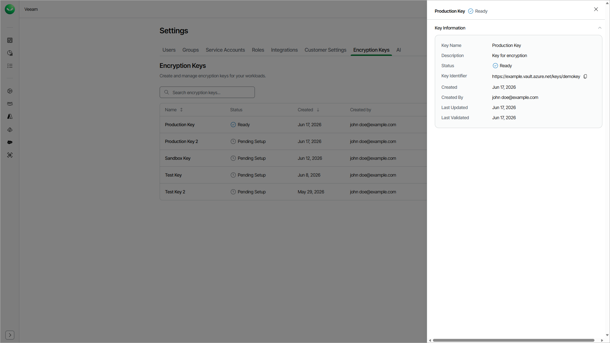

# Viewing Encryption Key Details

For each encryption key, Veeam Data Cloud shows detailed information, such as the key status, the key identifier and the date of the last validation.

To view the details of an encryption key, do the following:

1. Click the settings icon in the top-right corner.
2. Select Encryption Keys.
3. On the Encryption Keys tab, in the Actions column of the key, click the menu icon and select View Details.

The Key Information window shows the following properties of the key.

Viewing Encryption Key Details

| Property | Description |
| Key Name | Display name of the key in Veeam Data Cloud. |
| Description | Description of the key. This field appears only if you specified a description. |
| Status | Current status of the key: Pending Setup, Ready, Validation Failed, Active or Pending Deletion. |
| Key Identifier | Identifier of the key in your Microsoft Azure Key Vault. To copy the value, click the copy icon next to it. |
| Created | The date when the key was added. |
| Created By | The user who added the key. |
| Last Updated | The date when the key was last updated. |
| Last Validated | The date when Veeam Data Cloud last validated the key. This field appears only if the key was validated at least once. |
| Failure Reason | The reason why the last validation attempt failed. This field appears only if the key has the Validation Failed status. |

Page updated 2026-07-22
