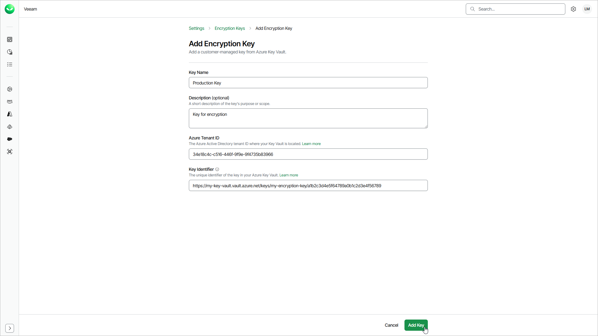

# Adding Encryption Keys

After you prepare a key in Microsoft Azure Key Vault, you add the encryption key in Veeam Data Cloud. When you add the key, you provide the Azure tenant ID and the key identifier, and Veeam Data Cloud attempts to validate the key. For details, see [Preparing Microsoft Azure Key Vault](encryption_keys_azure.md).

This feature is available only for users with the OrganizationAdmin role assigned.

To add an encryption key, do the following:

1. Click the settings icon in the top-right corner.
2. Select Encryption Keys.
3. On the Encryption Keys tab, click Add Key.
4. In the Key Name field, enter a display name that will identify the key in the list. The name can contain only letters, numbers, spaces, hyphens and underscores.
5. In the Description field, enter a description for your reference.
6. In the Azure Tenant ID field, enter the Azure tenant ID that you copied from Microsoft Entra ID.
7. In the Key Identifier field, enter the key identifier that you copied from your Microsoft Azure Key Vault. Veeam Data Cloud always uses the latest version of the key.
8. Click Add Key.

After you click Add Key, Veeam Data Cloud registers the key with the Pending Setup status and the Validate Encryption Key window opens. To grant Veeam Data Cloud access to the key and complete the setup, follow the steps in the window. For details, see [Validating Encryption Keys](encryption_keys_validate.md).

Page updated 2026-07-22
