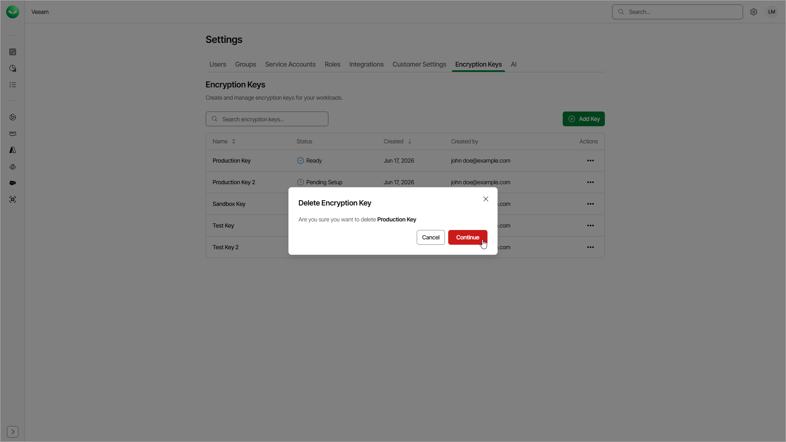

# Deleting Encryption Keys

You can delete an encryption key that you no longer need to use for encryption. You cannot delete an encryption key while a workload uses it. Before you delete the key, switch each workload that uses the key to a different encryption key or to Microsoft or Veeam Data Cloud managed keys.

To delete an encryption key, do the following:

1. Click the settings icon in the top-right corner.
2. Select Encryption Keys.
3. On the Encryption Keys tab, in the Actions column of the key, click the menu icon and select Delete
4. In the Delete Encryption Key window, click Continue.

After you click Continue, Veeam Data Cloud will attempt to delete the key:

* If the key is not in use, it will be deleted in Veeam Data Cloud. Your key in Microsoft Azure Key Vault is not affected.
* If the key is in use by one or more workloads, Veeam Data Cloud will not delete the key and will show the list of workloads that use the key. To delete the key, switch each listed workload to a different encryption key or to Microsoft or Veeam Data Cloud managed keys. Then delete the key again.

Page updated 2026-07-21
