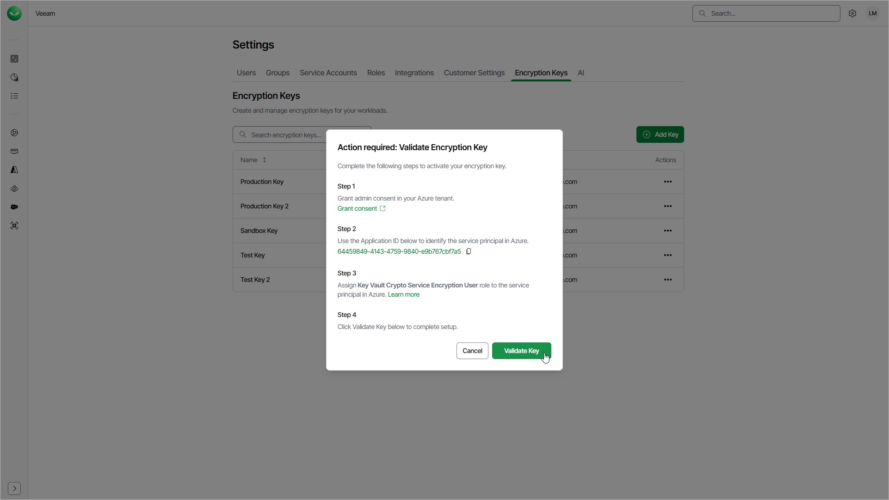

# Validating Encryption Keys

After you add an encryption key, Veeam Data Cloud cannot access it immediately. Before you can use the key for encryption, you must validate it. During validation, you grant Veeam Data Cloud access to your key in Microsoft Azure Key Vault, and Veeam Data Cloud runs a test that confirms it can use the key.

Before You Begin

Before you validate the key, make sure that you have the following permissions in Microsoft Azure:

* To grant admin consent to the Veeam Data Cloud application in the Microsoft tenant that owns the key vault, you must be a Microsoft Entra administrator with the Global Administrator or Privileged Role Administrator role.
* To assign the role to the Veeam Data Cloud service principal, you must have the Owner, User Access Administrator or Role Based Access Control Administrator role on the Key Vault.

Validating a Key

The Validate Encryption Key window opens automatically when you add a key. To open the window for a key that has the Pending Setup or Validation Failed status, in the Actions column of the key, click the menu icon and select Validate Key.

To validate the key, do the following:

1. To grant Veeam Data Cloud access in your Azure tenant, click Grant consent. In the new browser tab, sign in as a Microsoft Entra administrator and accept the requested permissions. Veeam Data Cloud requires admin consent once per Azure tenant that hosts your Key Vault.
2. Click the copy icon to copy the Application ID. You use this value to identify the Veeam Data Cloud service principal in Microsoft Azure.
3. Assign the Key Vault Crypto Service Encryption User role to the Veeam Data Cloud service principal on your Key Vault. To do that, do the following:

1. In the Microsoft Azure portal, open your Key Vault and go to Access control (IAM).
2. Click Add and select Add role assignment.
3. On the Role tab, select the Key Vault Crypto Service Encryption User role, then click Next.
4. On the Members tab, in Assign access to, select User, group, or service principal. Click Select members, paste the Application ID that you copied and select the Veeam Data Cloud service principal.

If the search does not return a result, search by the application name Veeam Data Cloud Customer Key Access instead.

1. Click Select.
2. Click Review + assign to complete the role assignment.

1. Click Validate Key.

After you click Validate Key, Veeam Data Cloud will validate the key:

* If the validation succeeds, the window will close and the key status will change to Ready. You can now use the key for encryption.

For details on how to use your key in Veeam Data Cloud Vault, see [Managing Storage Vaults](vault_storage_vaults_edit.md).

* If the validation fails, an error message appears in the window. To find out why the validation failed, view the key details and check the Failure Reason value. For details, see [Viewing Encryption Key Details](encryption_key_details.md).

Page updated 2026-07-22
