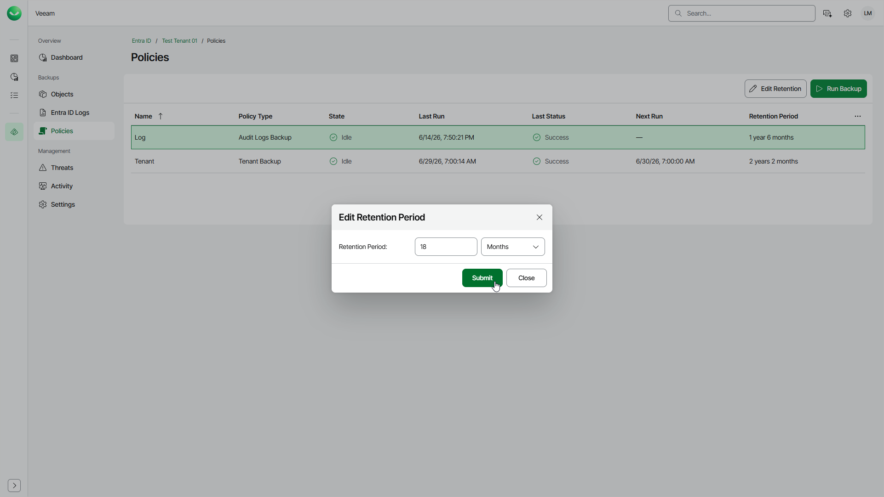

# Increasing Retention Period

To keep backups longer before Veeam Data Cloud deletes them, you can increase the retention period.

To increase the retention period, do the following:

1. On the Entra ID page, click the name of the tenant you want to manage.
2. Select Policies.
3. Select the backup policy for which you want to increase the retention period:

* Select Log to increase retention for your Entra ID audit log backups.
* Select Tenant to increase retention for your Entra ID object backups.

1. Click Edit Retention.
2. In the Edit Retention Period window, specify a new retention period. The new retention period cannot be shorter than the current one. The maximum value is 99 years or 1,187 months.
3. Click Submit to save the changes.

