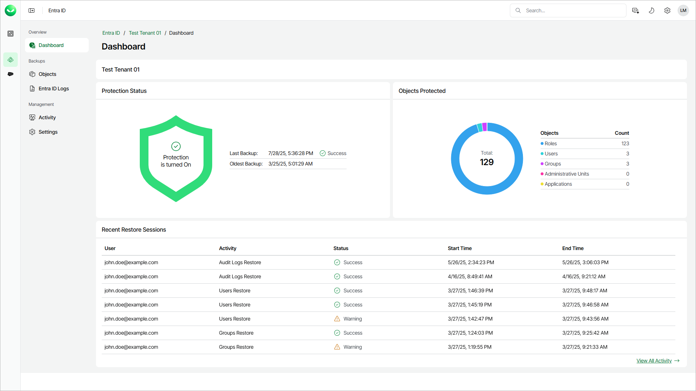

# Viewing Dashboard

In this article

The Veeam Data Cloud for Microsoft Entra ID dashboard contains information on the state of the protection of your Microsoft Entra ID tenant, the number of protected objects and the recent restore sessions.

To view the dashboard, do the following:

1. On the Entra ID page, click the name of the tenant you want to manage.
2. The dashboard is the landing page when you open a tenant. To return to the Entra ID tenant dashboard from a different page, click Dashboard.

The Dashboard page displays the following widgets.

* The Protection Status widget displays information on state of your Entra ID backups.
* The Objects Protected widget displays information on the number of protected Entra ID objects.
* On the Recent Restore Sessions widget, you can review the log of recent restore sessions. Click View All Activity to display a complete log of activities. For details, see [Viewing Backup and Restore Sessions](entra_id_activity.md).

Page updated 10/14/2025
