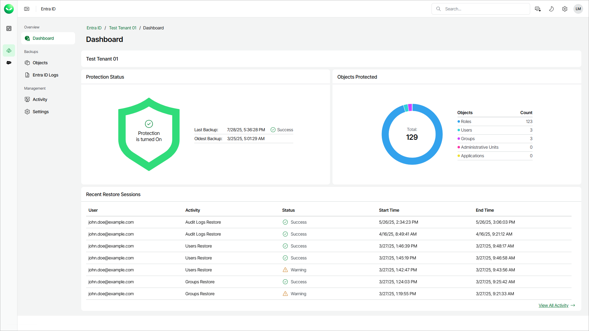

# Viewing Dashboard

The Veeam Data Cloud for Microsoft Entra ID dashboard contains information on the state of the protection of your Microsoft Entra ID tenant, the number of protected objects and the recent restore sessions.

To view the dashboard, do the following:

1. On the Entra ID page, click the name of the tenant you want to manage.
2. The dashboard is the landing page when you open a tenant. To return to the Entra ID tenant dashboard from a different page, click Dashboard.

The Dashboard page displays the following sections.

* The Protection Status section displays information on state of your Entra ID backups.
* The Objects Protected section displays information on the number of protected Entra ID objects.

|  |
| --- |
| note |
| The number of protected Entra ID users includes all existing users in your Microsoft Entra ID tenant, regardless of their type or status. This number may differ from the number of consumed licenses because only enabled Entra ID member users are counted towards the license. For details, see [Licensing](entra_id_licensing.md). |

* In the Recent Activity section, you can review the log of recent backup and restore sessions. Click View All Activity to display a complete log of activities. For details, see [Viewing Backup and Restore Sessions](entra_id_activity.md).

