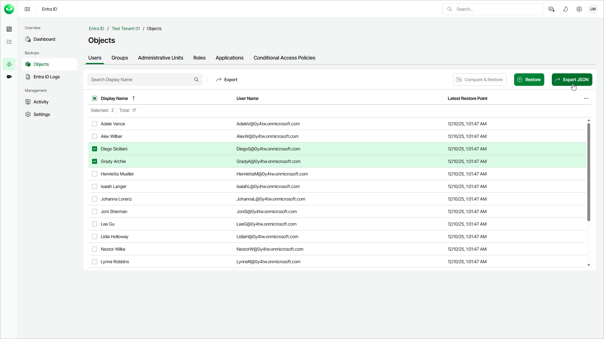

# Step 1. Launch Export Object Wizard

In this article

To launch the Export Objects wizard, do the following:

1. On the Entra ID page, click the name of the tenant you want to manage.
2. Select Objects.
3. Make sure that the tab with the Entra ID object type that you want to export is selected.
4. In the list of objects, select one or more objects that you want to export.

If you switch between tabs, your selection is discarded. You can export only objects of one type at a time.

|  |
| --- |
| Tip |
| Consider the following:   * To find an object by its display name, you can use the search field. * To show more object properties, click the menu icon and select the properties you want to show. |

1. To launch the export wizard, click Export JSON.

Page updated 12/15/2025
