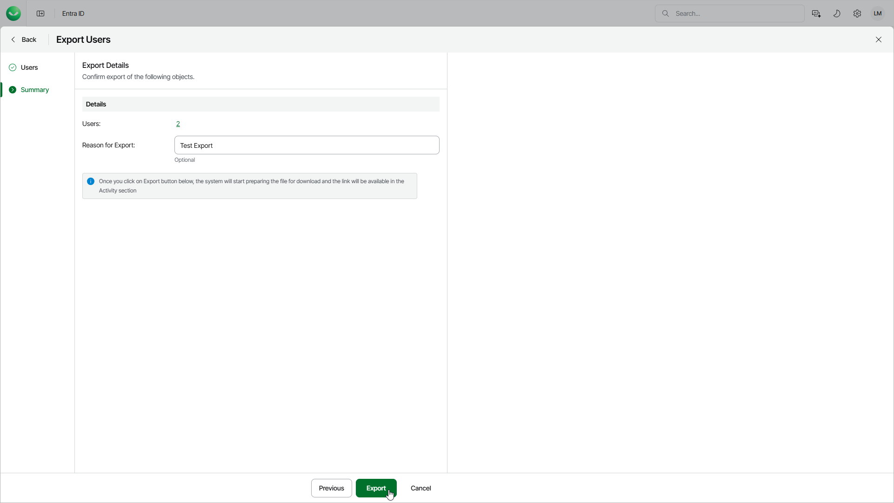

# Step 3. Finish Working with Wizard

In this article

At the Summary step of the wizard, review the summary information and click Export.

In the Reason for Export field, you can enter a reason for exporting objects. This information will be saved to the session history, and you will be able to reference it later.

Veeam Data Cloud will create a download link once the files are exported and ready to download.

Page updated 12/15/2025
