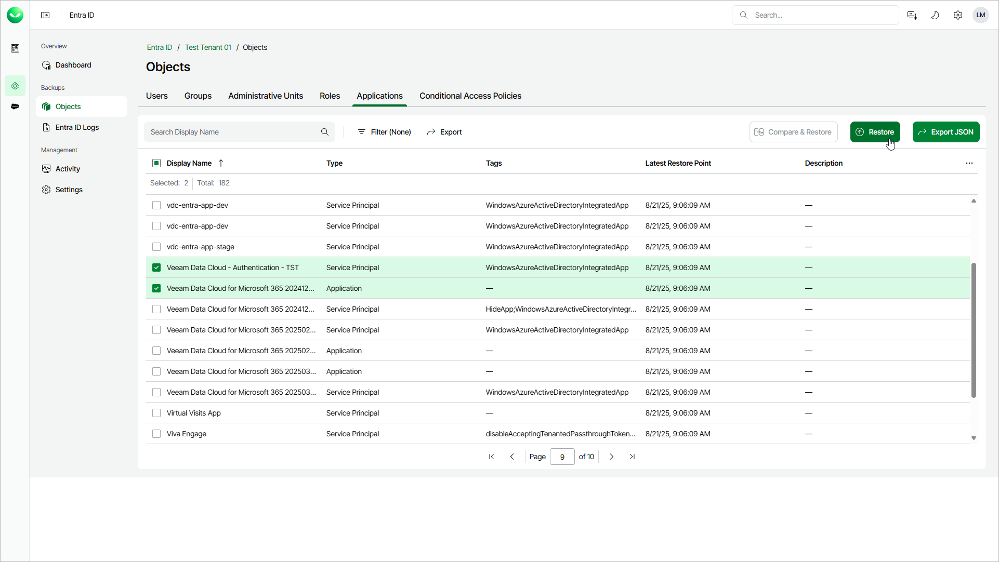

# Step 1. Launch Restore Applications Wizard

To launch the Restore Applications wizard, do the following:

1. On the Entra ID page, click the name of the tenant you want to manage.
2. Select Objects.
3. Make sure that the Applications tab is selected.
4. In the list of objects, select those you want to restore.

|  |
| --- |
| Tip |
| Consider the following:   * To find an objects by its display name, you can use the search field.  * To show more object properties, click the menu icon and select the properties you want to show. * To filter objects based on whether they are an application or a service principal, click Filter and select the required values. * To export the list of applications for future references and imports, click Export and select the format in which you want to save the list. Veeam Data Cloud will export all backed-up objects and their properties that can be shown in the restore window. |

1. To launch the restore wizard, click Restore

|  |
| --- |
| Important |
| [Entire restore of permanently deleted and linked applications and service principals] You can restore a service principal that represents an application only together with this application and within one restore session. If you restore the application in a separate restore session, the restored application gets a new AppID. The service principal will not recognize this new ID, and the restore of the service principal will fail. |

